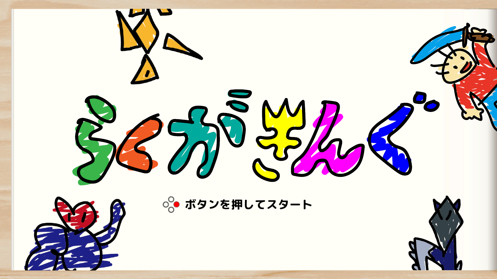
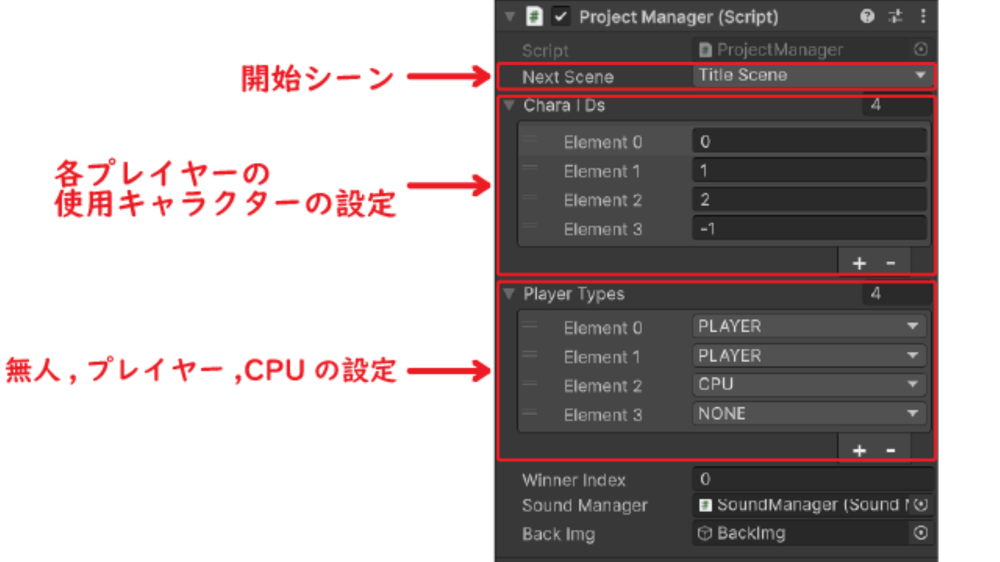
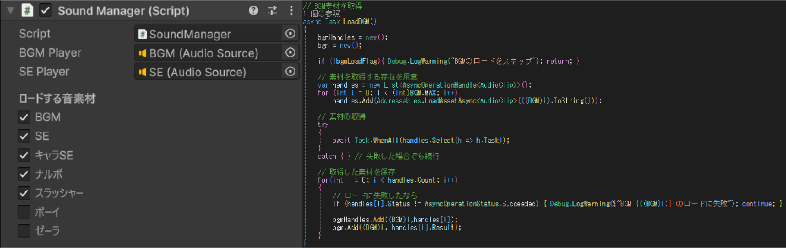
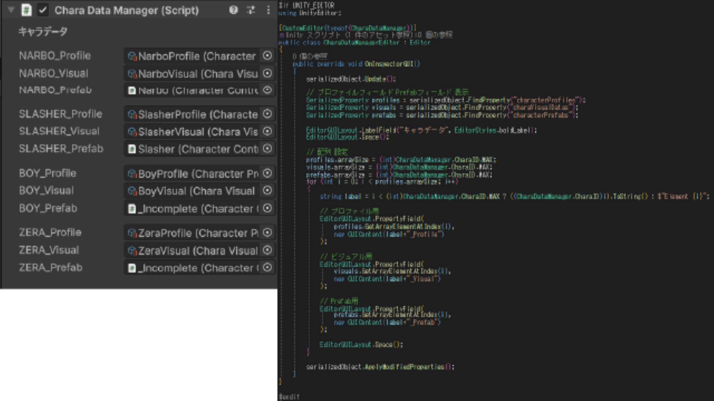
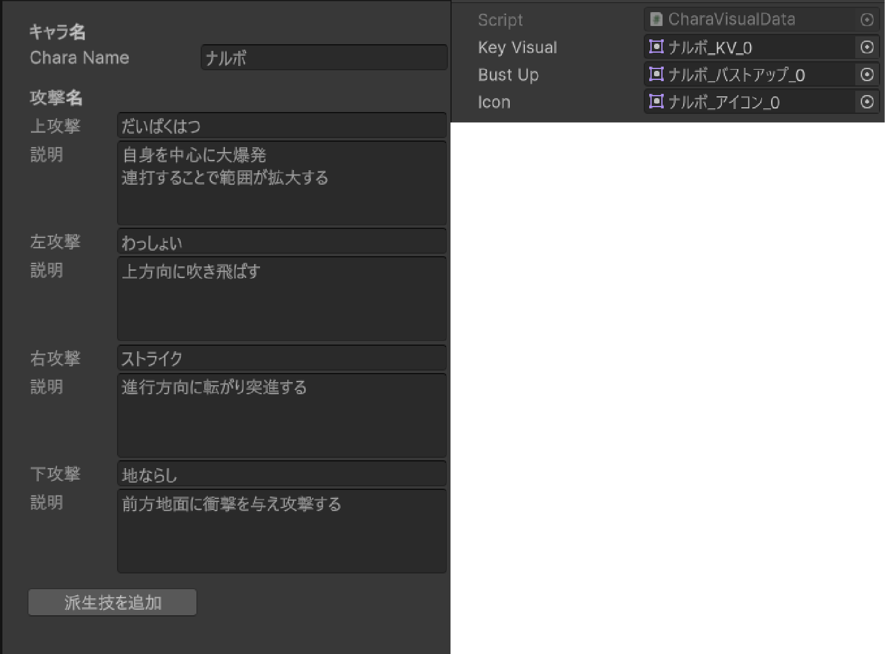

# らくがきんぐ
最大4人で遊べる対戦ゲーム。 
落書きをモチーフに、個性あるキャラクターたちが繰り広げるハチャメチャバトル。 
&nbsp;

## 開発ポイント
ProjectManagerがゲーム全体の管理を担当。 
Inspecter上で設定できるようにし、デバッグのしやすい環境を目指しました。

開発段階ですべての音素材がそろっているわけではないため、 
ロードする音素材を選択できるようにしました。 
音素材のロードにはAddressablesを使用し、ロード処理を並列で行っています。

キャラクター関係はCharaDataManagerで管理しています。

## 使用技術
- Unity 6000.0.64f1
- C#
- DOTween / Addressables

## 制作期間
1ヶ月

## 制作体制
チーム制作（プログラマー兼デザイナー担当） 
・プランナー　　1人 
・プログラマー　2人